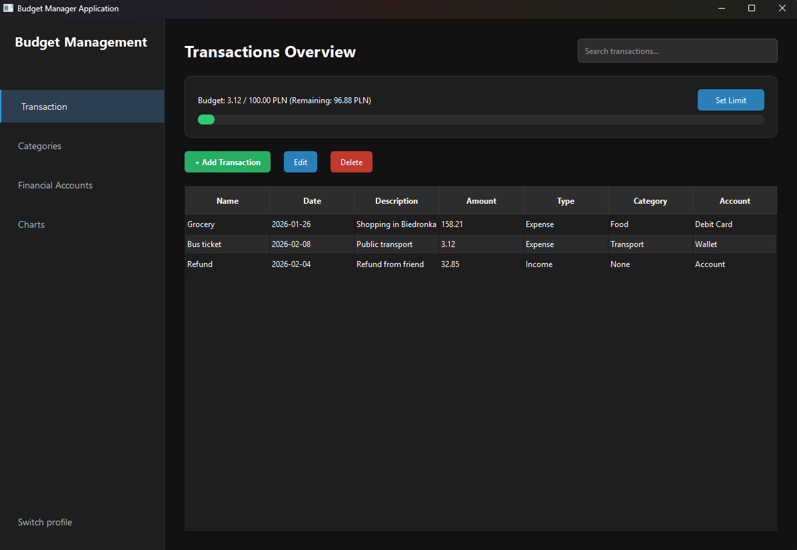
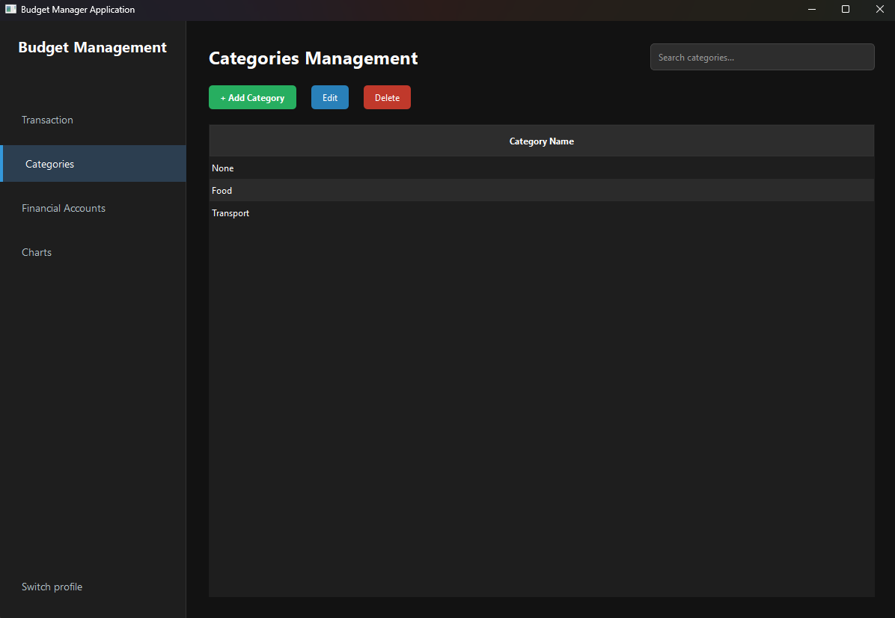
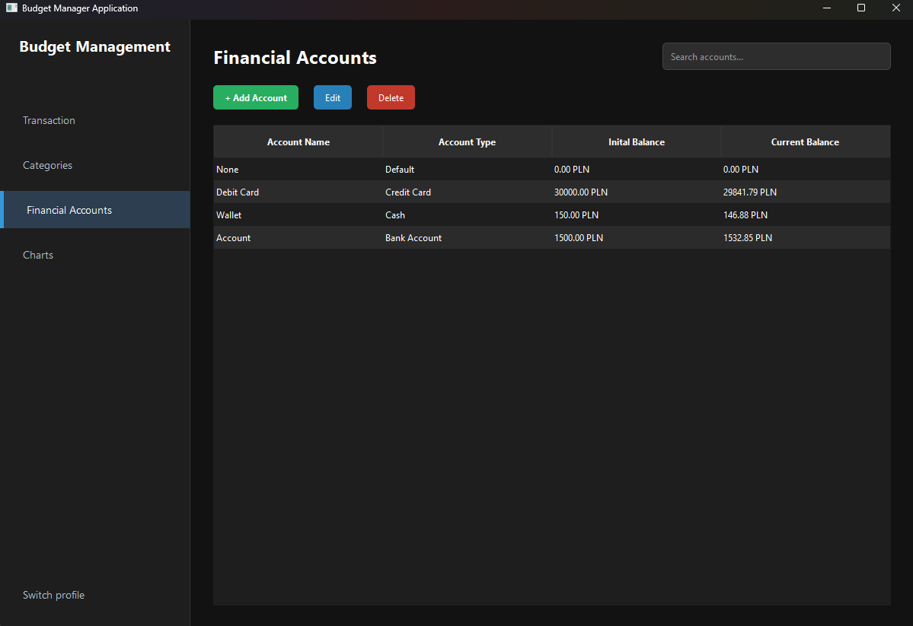
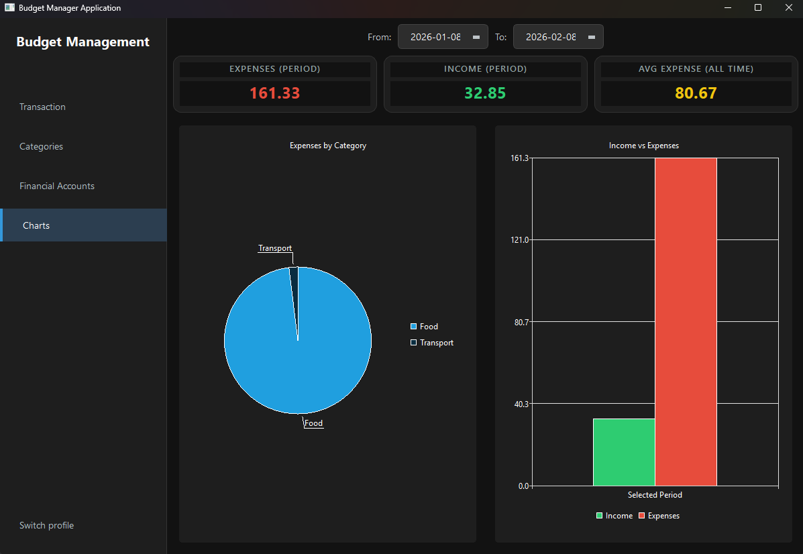

# Budget Management App

### Overview
This project is a offline desktop application developed for comprehensive home budget management. The system empowers users to take full control of their personal finances by tracking income and expenses, creating monthly budgets, and generating clear financial statistics and charts. By working entirely offline, the application ensures maximum data privacy and security for the user. The project follows the **Model-View-Controller (MVC)** architectural pattern.

---

### Key Features
* **Transaction Logging:** Detailed transaction entry including name, date, amount, category, financial account and custom description.
* **Custom Categories:** Ability to define and manage custom categories.
* **Account Management:** Support for multiple account types.
* **Monthly Budgeting:** Set spending limits for the entire month.
* **Visual Analytics:** Interactive reports visualized through pie and bar charts for clear data interpretation.
* **Data Portability:** Export data via CSV files.
* **Secure Access:** Built-in user authentication requiring a password to access data.
* **Automated Backups:** Local data safety ensured through an automated background backup system.
* **Search & Filtering:** Advanced tools to quickly find transactions by date, category, or keywords.
* **Offline Mode:** Full functionality without any internet dependency, prioritizing user privacy.

---

### Tech Stack
* **Language:** C++14
* **Framework:** Qt 
* **Database:** SQLite
* **Architecture:** MVC Pattern
* **Environment:** Visual Studio

---

### Architecture & Design
The application is built with a strict separation of concerns using the **MVC pattern**:
* **Model:** Manages the SQLite database interface, data persistence, and core business logic.
* **View:** A responsive GUI built with Qt Widgets, designed for intuitive user experience.
* **Controller:** Orchestrates communication between the UI and the data layer.

---

### Visuals
* **Authentication:** 
* **Transactions:** 
* **Category Management:** 
* **Accounts Overview:** 
* **Statistics & Reports:** 

---

### Documentation

Full technical documentation is available in Polish and provides an in-depth look at the project's engineering process. Documentation includes:
* **Initial Project Specification:** Requirements and scope.
* **UML Diagrams:** Class diagrams, Sequence diagrams and Use Case diagrams.
* **Testing approach:** Overview of the approach used to ensure application stability.

[Full documentation (PDF)](Documentation/BMA_docs.pdf)
